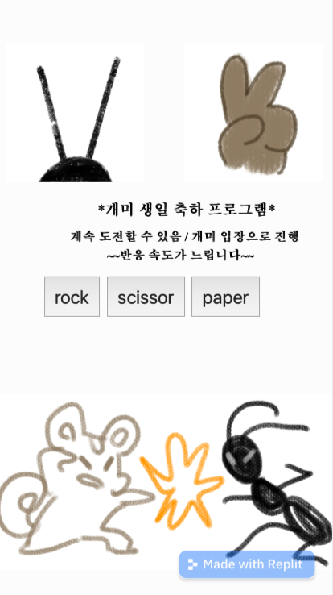
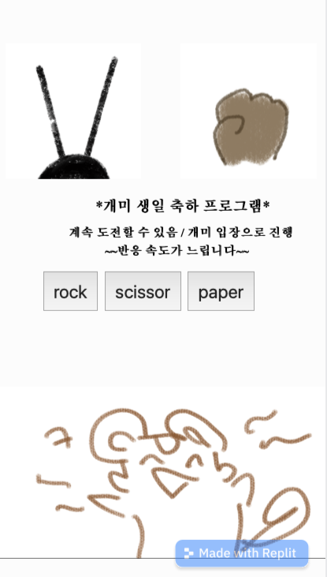
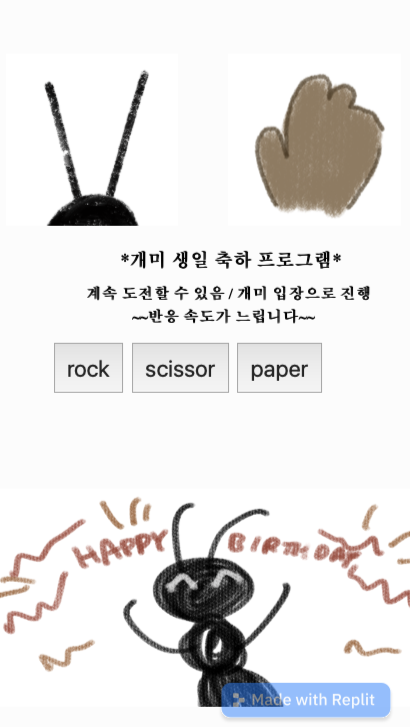
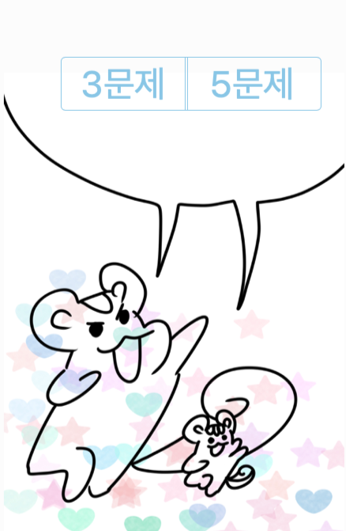
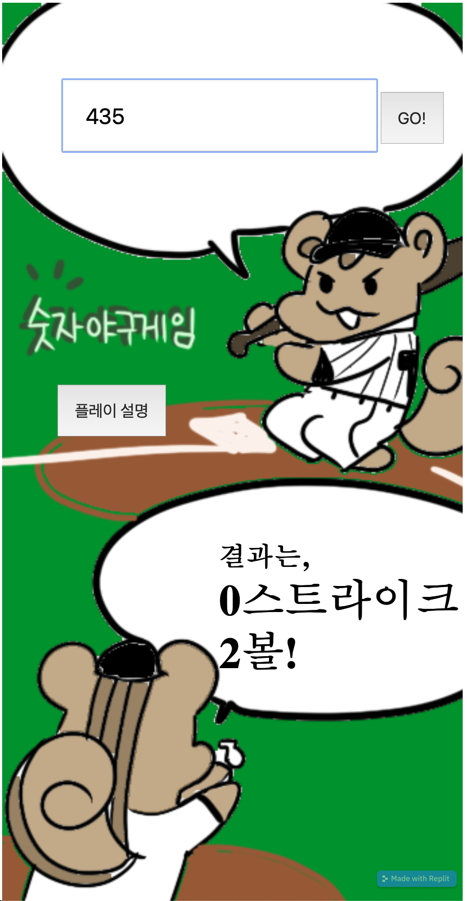
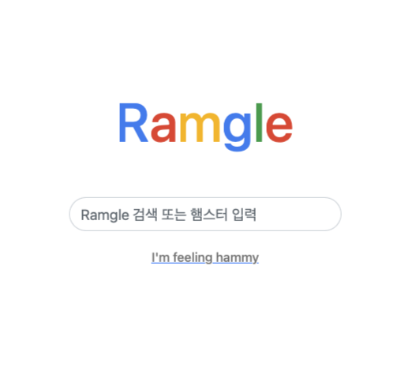
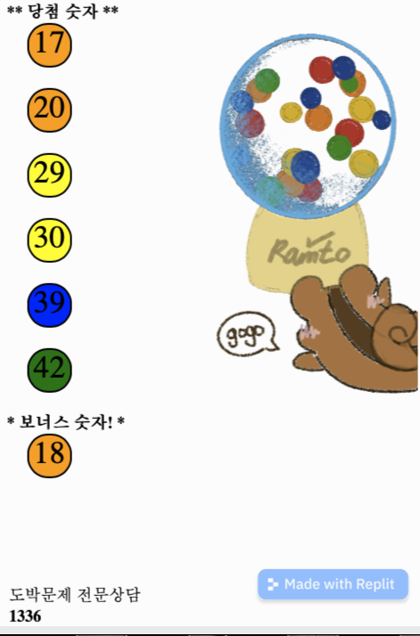
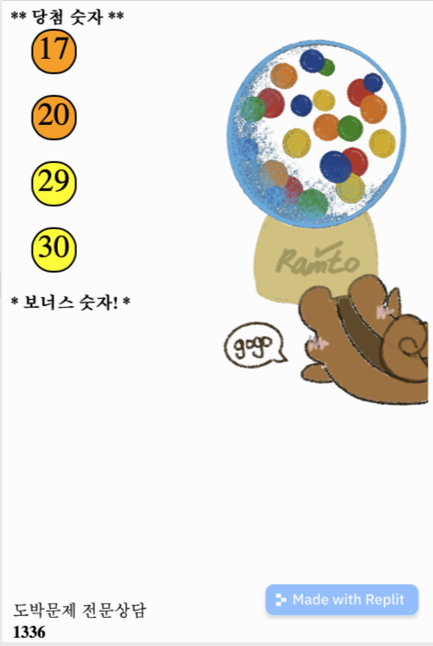
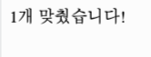
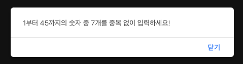

# a-legacy-of-the-past

막 코딩 시작할 때 만들었던 게임들

## 🌟antBirthday

### 개미 생일선물용 가위바위보 게임

비긴거

내가이긴 거

개미가 이긴 거

### link

실행 링크 : https://701695de-b28d-4aaa-a342-eb8a3db54e05-00-1d6qmwuzgsp1k.riker.replit.dev
블로그 링크 : https://junggoldchae-coding.tistory.com/entry/HTMLCSSJS-개미-생일-가위바위보-게임-미완

## 🌟GUGUDAN

### 구구단 게임

3문제랑 5문제 선택 가능

### link

실행 링크 : https://3df26bb0-dfc1-4eaf-a15d-d423c6b0a9f0-00-1wglg3i4wkc6f.picard.replit.dev
블로그 링크 : https://junggoldchae-coding.tistory.com/entry/HTMLCSSJS-구구단게임

## 🌟NumberBaseBall

### 숫자야구 게임

### link

실행 링크 : https://701695de-b28d-4aaa-a342-eb8a3db54e05-00-1d6qmwuzgsp1k.riker.replit.dev
블로그 링크 : https://junggoldchae-coding.tistory.com/entry/HTMLCSSJS-숫자야구게임

## 🌟Ramgle

### 구글 창 만들어보기

생각해보니까 얘가 진짜 제일 처음 코딩이었던 것 같은데

### link

실행 링크 : https://4a1100e0-8bf6-4f8c-a853-0be0dddfdeb0-00-19ilhxbzfna7q.riker.replit.dev

## 🌟RoTTo

### 로또게임

이거 해 보고 로또를 왜 하면 안 되는지 알았다
4개 맞춘 사람을 본 적이 없어

### link

실행 링크 : https://1de3a373-4d40-4e71-a572-93c54aa95c26-00-3m4s7ed6a77i4.janeway.replit.dev
블로그 링크 : https://junggoldchae-coding.tistory.com/entry/HTMLCSSJS로또-추첨-게임-미완
